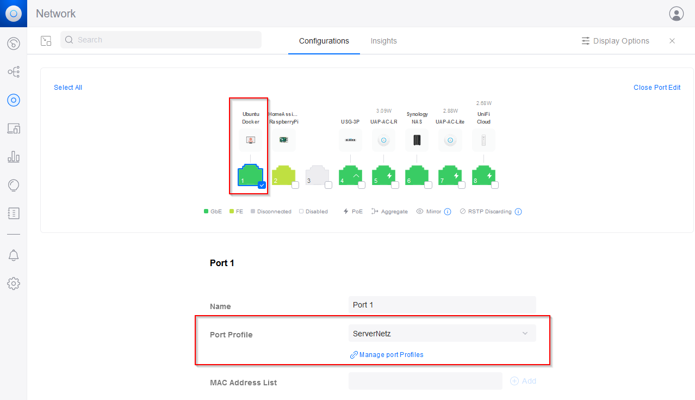

# graylog
How to get Graylog running in your home using Docker


I have spend several nights in trying to get Graylog running at home. There are a lot of manuals out there, some very basic, some slightly outdated. So here is the summary on how I did it.


## Background
* Server: I got my hands on an old _HP EliteDesk 800 G2_ with 8GB RAM and 128GB disk space. This will be my server, running _Ubuntu Server 22.04.1 LTS_.
* Network: I have a Unifi environment at home. The network is segmented into different VLANs. The Ubuntu and Graylog should be in _VLAN70_. Other containers will be in other VLANS. (e.g. HomeAssisnant, AdGuard, OpenVPN, ...)

## Preparation
### promiscuous mode
As I am working with different VLANs, the network card of my server has to be in _promiscuous mode_. [Docker: Use macvlan networks](https://docs.docker.com/network/macvlan/)
Put this code in your /etc/rc.local. [askubuntu](https://askubuntu.com/questions/430355/configure-a-network-interface-into-promiscuous-mode)
```
ifconfig eth1 up
ifconfig eth1 promisc
```
Make sure to set the right network name. (My network is called _eno1_.)

### 802.1q trunk switch port
My server is wired to a switch. Because I am using different VLANs, the switch port has to be configured, so that the respective traffic can be received on that switch port. In Unifi, this is done like this: [A non-expert Guide to VLAN and Trunks in Unifi Switches](https://community.ui.com/questions/A-non-expert-Guide-to-VLAN-and-Trunks-in-Unifi-Switches/7462245c-95a7-455e-a711-209f44e194cb)
* create a _switch port profile_

* apply profile to switch port


