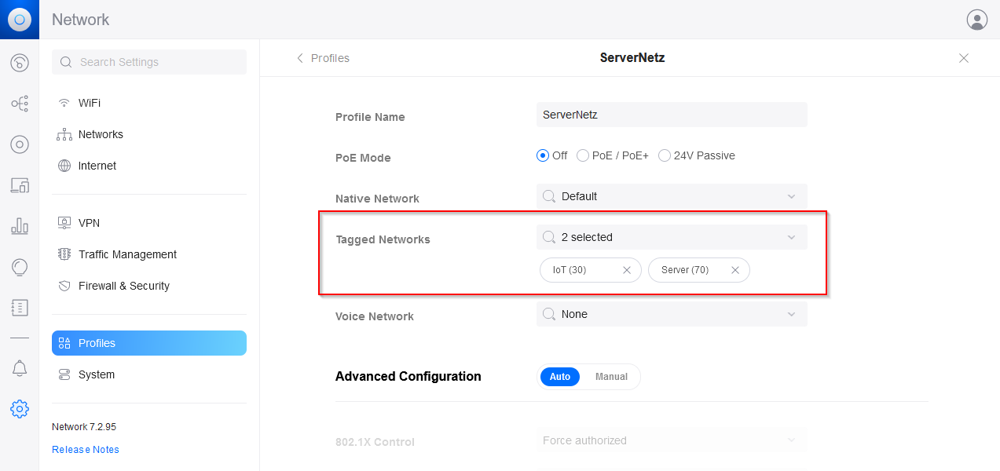

# graylog
How to get Graylog running in your home using Docker


I have spend several nights in trying to get Graylog running at home. There are a lot of manuals out there, some very basic, some slightly outdated. I got a lot of help from the Graylog-Community-Forum and the Docker-Community-Forum. Most of the following inputs are based on their knowledge and advise.
So here is the summary on how I did it.


## Background
* Server: I got my hands on an old _HP EliteDesk 800 G2_ with 8GB RAM and 128GB disk space. This will be my server, running _Ubuntu Server 22.04.1 LTS_.
* Network: I have a Unifi environment at home. The network is segmented into different VLANs. The Ubuntu and Graylog should be in _VLAN70_. Other containers will be in other VLANS. (e.g. HomeAssisnant, AdGuard, OpenVPN, ...)

## Preparation
### promiscuous mode
As I am working with different VLANs, the network card of my server has to be in _promiscuous mode_. [Docker: Use macvlan networks](https://docs.docker.com/network/macvlan/)
Put this code in your /etc/rc.local. [askubuntu](https://askubuntu.com/questions/430355/configure-a-network-interface-into-promiscuous-mode)
```
ifconfig eth1 up
ifconfig eth1 promisc
```
Make sure to set the right network name. (My network is called _eno1_.)

### 802.1q trunk switch port
My server is wired to a switch. Because I am using different VLANs, the switch port has to be configured, so that the respective traffic can be received on that switch port. In Unifi, this is done like this: [A non-expert Guide to VLAN and Trunks in Unifi Switches](https://community.ui.com/questions/A-non-expert-Guide-to-VLAN-and-Trunks-in-Unifi-Switches/7462245c-95a7-455e-a711-209f44e194cb)
* create a _switch port profile_

* apply profile to switch port


:warning: Please note: I want to have my server and some of the Docker containers in the same VLAN. Unfortunately, I was not able to get this working. (Still open discussion in Docker forum: [How to set host and containes in same vlan](https://forums.docker.com/t/how-to-set-host-and-containes-in-same-vlan/133416))

### Folders for persisting data
To be able to persist data, you need to create some folders and set the needed permissions.

#### create user _graylog_ with id _1100_
When you start your graylog container in docker, it will be using a user _graylog_ with id _1100_. You have to create this user in your ubuntu.

```
sudo useradd -u 1100 graylog
```

#### create _graylog_data_
Create a folder with the name _graylog\_data_. Do this in a path with easy access. I have chosen this one:
```
mkdir /home/uadmin/Docker/Graylog/graylog_data
```
As my server is running in my own network, the server itself has very limited access to the internet, I gave access to all users:
```
sudo chmod -R a+rwx /home/uadmin/Docker/Graylog/graylog_data
```

#### create _es\_data_
Elasticsearch needs a folder as well to persist data.
```
mkdir /home/uadmin/Docker/Graylog/es_data
```
Change access rights:
```
sudo chmod -R a+rwx /home/uadmin/Docker/Graylog/es_data
```

#### create _mongo\_data_
```
mkdir /home/uadmin/Docker/Graylog/mongo_data
```
```
sudo chmod -R a+rwx /home/uadmin/Docker/Graylog/mongo_data
```


